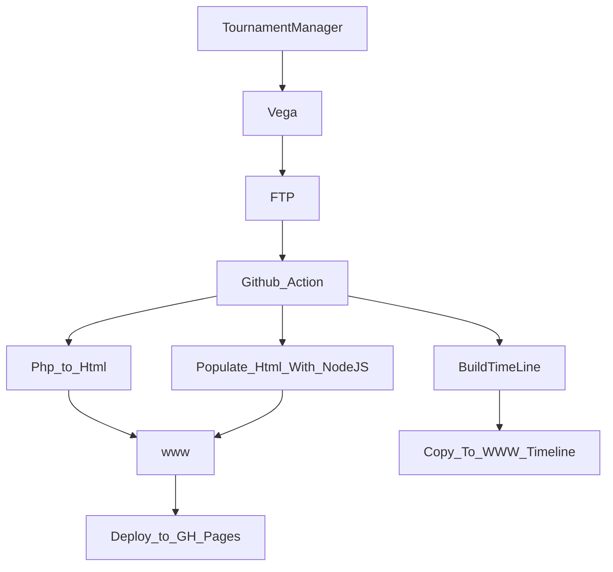

## INTRODUCTION

This repo using to host the static published html (php) from Vega software for all tournaments run by Hobsons Bay Chess Club

## How it works
- Tournament manager using VEGA software to run tournament
- Vega publish to FTP server
- Github action run every x minutes to pull the changes from FTP server
- Github action running php web service to render all php files to html
- The github.io will host the out put html on live website at https://tournament.hobsonsbaychess.com/



## Automated Workflows

### Daily Rating Enrichment
The system automatically updates player ratings daily at 2:00 AM UTC (10:00 AM AEST) through a GitHub Actions workflow.

**What it does:**
- Downloads latest FIDE and ACF rating lists
- Enriches player data with current ratings, titles, and birth years
- Updates both junior and senior player files
- Commits changes back to the repository
- Copies updated files to the Next.js public directory

**Files updated:**
- `www/junior-ratings.json` - Junior player ratings
- `www/open-ratings.json` - Senior player ratings
- `v2/public/junior-ratings.json` - For Next.js app
- `v2/public/open-ratings.json` - For Next.js app

**Manual trigger:**
You can manually trigger the rating enrichment from the GitHub Actions tab in the repository.

**Testing locally:**
```bash
./scripts/test-rating-enrichment.sh
```
