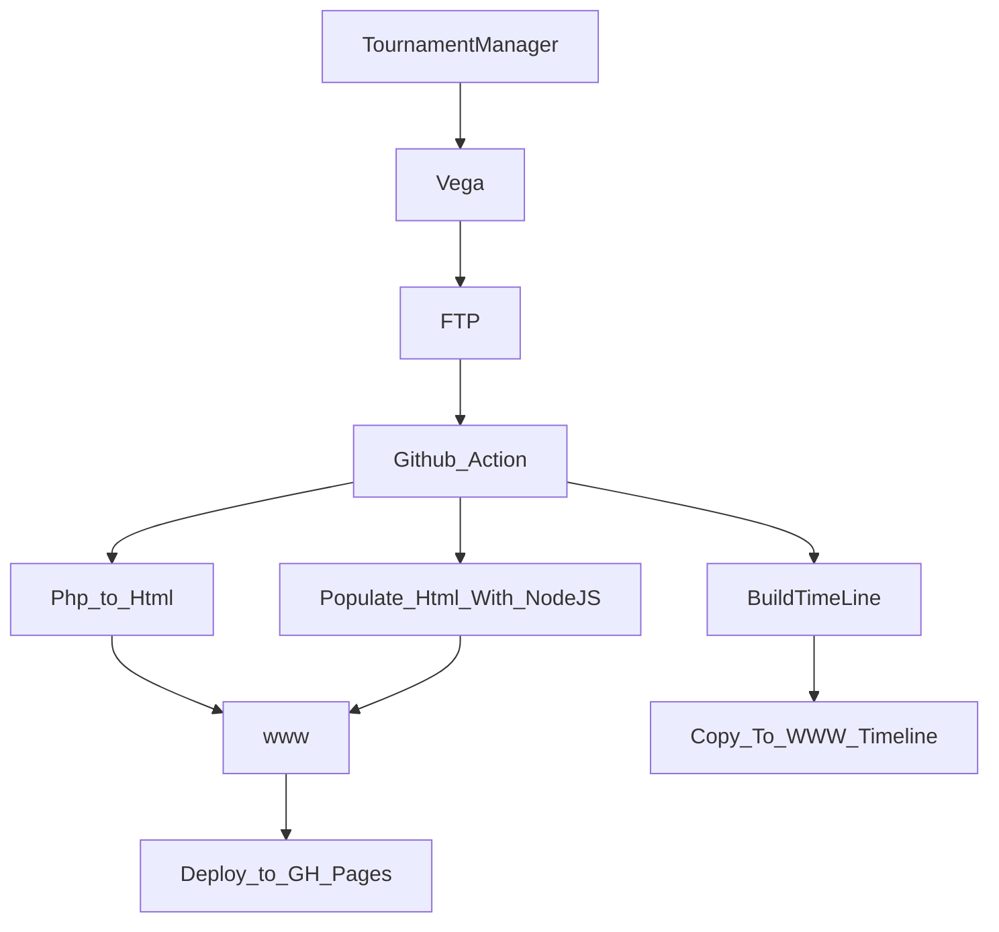

## INTRODUCTION

This repo using to host the static published html (php) from Vega software for all tournaments run by Hobsons Bay Chess Club

## How it works
- Tournament manager using VEGA software to run tournament
- Vega publish to FTP server
- Github action run every x minutes to pull the changes from FTP server
- Github action running php web service to render all php files to html
- The github.io will host the out put html on live website at https://tournament.hobsonsbaychess.com/

